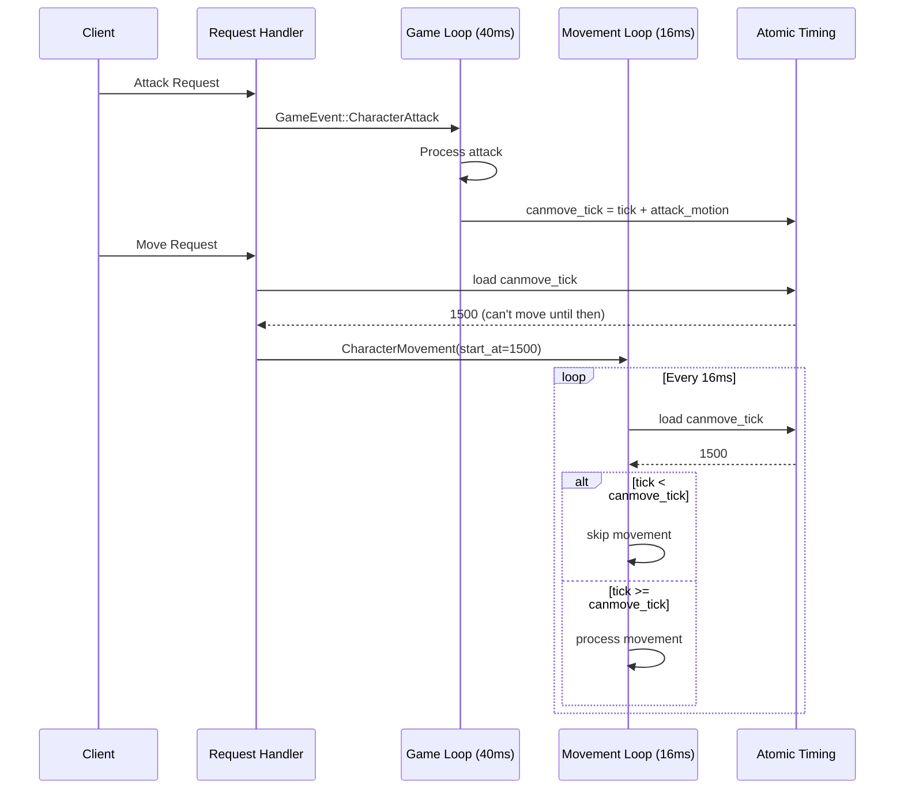
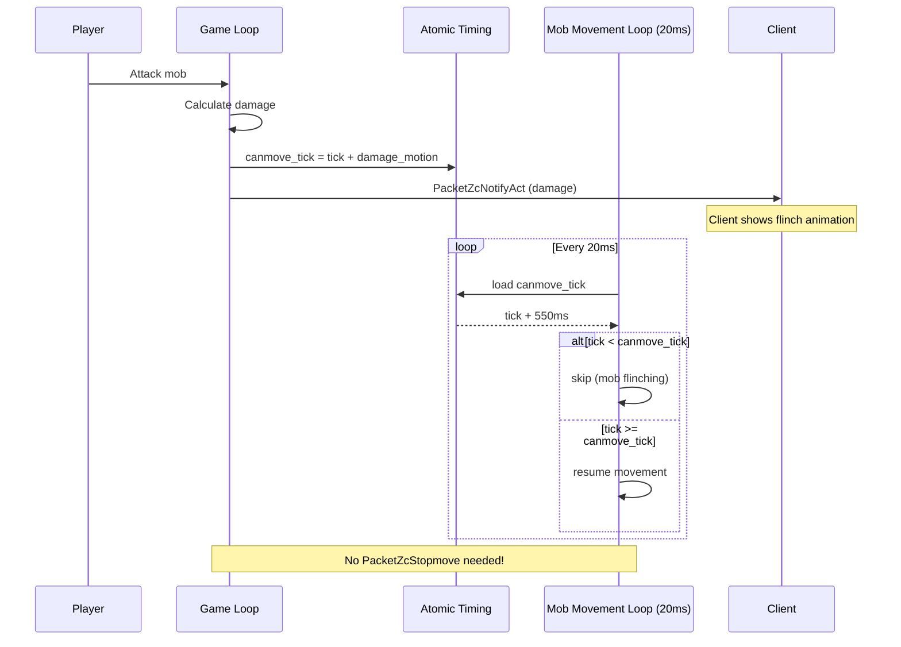
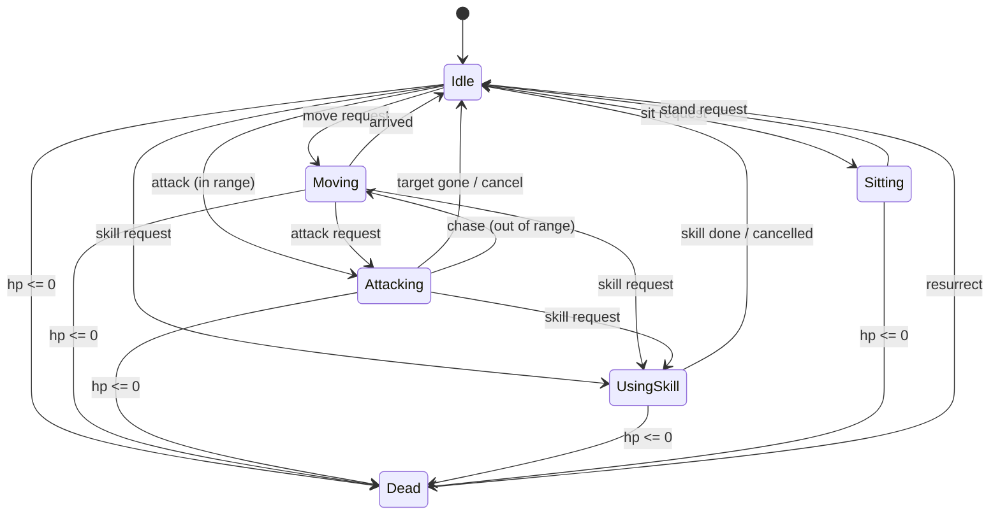
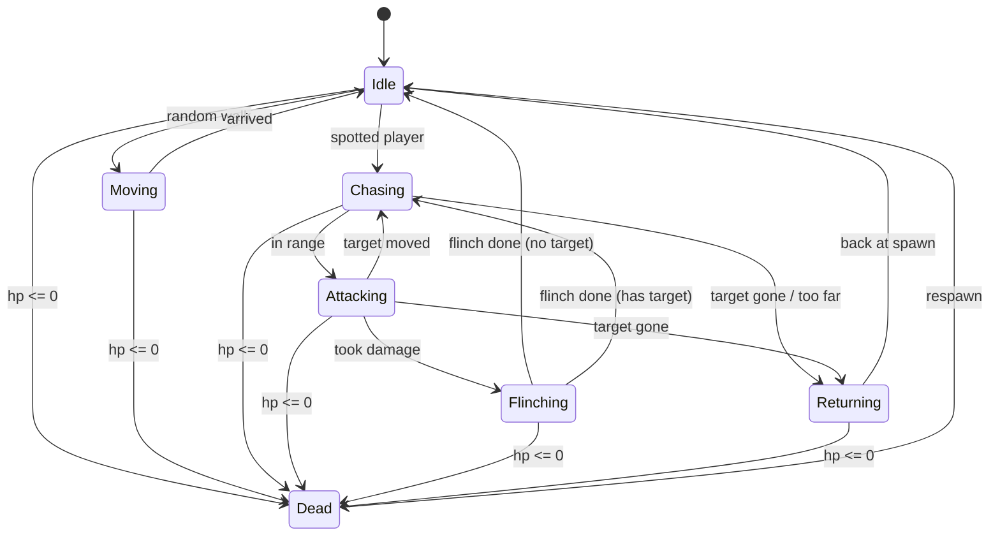

# State Machine Refactor Plan

## The Problem

Current state is a mess - scattered across multiple optional fields:
- `attack: Option<Attack>`
- `skill_in_use: Option<SkillInUse>`
- `movements: Vec<Movement>`
- `sit: bool`

Nothing prevents invalid combinations. And the threading model causes race conditions because movement thread (16ms) and game loop (40ms) both touch character state without proper sync.

Also found out from rathena research:
- Don't send `PacketZcStopmove` for mob flinch - just use `canmove_tick`
- Attack tick should be initialized to current tick, not 0
- The `-40` in movement delay formula is wrong

## Solution

Two parts:
1. Single action enum instead of scattered optionals
2. Atomic timestamps for cross-thread timing checks

## Character Action Enum

```rust
pub enum CharacterAction {
    Idle,

    Moving {
        destination: Position,
        path: Vec<Movement>,
        started_at: u128,
    },

    Attacking {
        target_id: u32,
        repeat: bool,
        started_at: u128,
        last_attack_at: u128,
        attack_motion: u32,
    },

    UsingSkill {
        skill: Box<dyn Skill>,
        target: Option<u32>,
        cast_start: u128,
        cast_end: u128,
    },

    Sitting,

    Dead,
}
```

Now it's impossible to be attacking while sitting, etc.

## Atomic Timing



For cross-thread checks without locks:

```rust
pub struct CharacterTiming {
    pub canmove_tick: AtomicU64,
    pub canact_tick: AtomicU64,
    pub x: AtomicU16,
    pub y: AtomicU16,
}
```

Game loop writes these when state changes. Movement thread reads them to check if movement is allowed.

```rust
// Game loop sets timing when attack starts
character.timing.canmove_tick.store(tick + attack_motion, Ordering::Release);

// Movement thread checks before processing
if tick < character.timing.canmove_tick.load(Ordering::Acquire) {
    return; // can't move yet
}
```

No locks, no sleep, no race conditions.

## Mob Action Enum

```rust
pub enum MobAction {
    Idle { idle_until: u128 },
    Moving { destination: Position, path: Vec<Movement>, started_at: u128 },
    Chasing { target_id: u32, last_path_calc: u128 },
    Attacking { target_id: u32, last_attack_at: u128, attack_motion: u32 },
    Flinching { until: u128 },
    Returning { spawn_point: Position },
    Dead { death_time: u128, respawn_at: u128 },
}
```

Key insight: `Flinching` state + atomic `canmove_tick` replaces the need for `PacketZcStopmove`. Movement thread just skips when `canmove_tick` hasn't passed.

### 4. Mob flinch without stop packet



In `map_instance_service.rs` when mob takes damage:
```rust
pub fn mob_being_attacked(&mut self, mob: &mut Mob, tick: u128, damage_motion: u32) {
    // Set atomic timing - movement thread will see this
    mob.timing.canmove_tick.store((tick + damage_motion as u128) as u64, Ordering::Release);

    // Update state
    mob.action = MobAction::Flinching { until: tick + damage_motion as u128 };

    // NO PacketZcStopmove - client shows flinch animation from damage packet
}
```

In mob movement loop:
```rust
if tick < mob.timing.canmove_tick.load(Ordering::Acquire) as u128 {
    continue; // still flinching
}
```

### 5. Add atomic timing structs

```rust
// In character.rs
pub struct Character {
    pub action: CharacterAction,
    pub timing: CharacterTiming,
    // ... rest
}

// In mob.rs
pub struct Mob {
    pub action: MobAction,
    pub timing: MobTiming,
    // ... rest
}
```


### Tick alignment diagram

```mermaid
gantt
    title Tick Alignment (20ms base)
    dateFormat X
    axisFormat %L

    section Game Loop
    tick 0    :g0, 0, 1
    tick 40   :g1, 40, 1
    tick 80   :g2, 80, 1
    tick 120  :g3, 120, 1

    section Char Movement
    tick 0    :c0, 0, 1
    tick 20   :c1, 20, 1
    tick 40   :c2, 40, 1
    tick 60   :c3, 60, 1
    tick 80   :c4, 80, 1
    tick 100  :c5, 100, 1
    tick 120  :c6, 120, 1

    section Mob Movement
    tick 0    :m0, 0, 1
    tick 20   :m1, 20, 1
    tick 40   :m2, 40, 1
    tick 60   :m3, 60, 1
    tick 80   :m4, 80, 1
    tick 100  :m5, 100, 1
    tick 120  :m6, 120, 1
```



Every 40ms, all three loops align. Movement loops get 2 ticks per game loop tick.

## State Transitions Reference

### Character



### Mob



## Files to Modify

- `server/src/server/state/character.rs` - add CharacterAction, CharacterTiming
- `server/src/server/state/mob.rs` - add MobAction, MobTiming
- `server/src/server/game_loop.rs` - fix attack tick init, use new state
- `server/src/server/request_handler/movement.rs` - remove sleep, use atomic check
- `server/src/server/service/map_instance_service.rs` - mob flinch with atomic timing
- `server/src/server/map_instance_loop.rs` - check atomic canmove_tick for mobs
